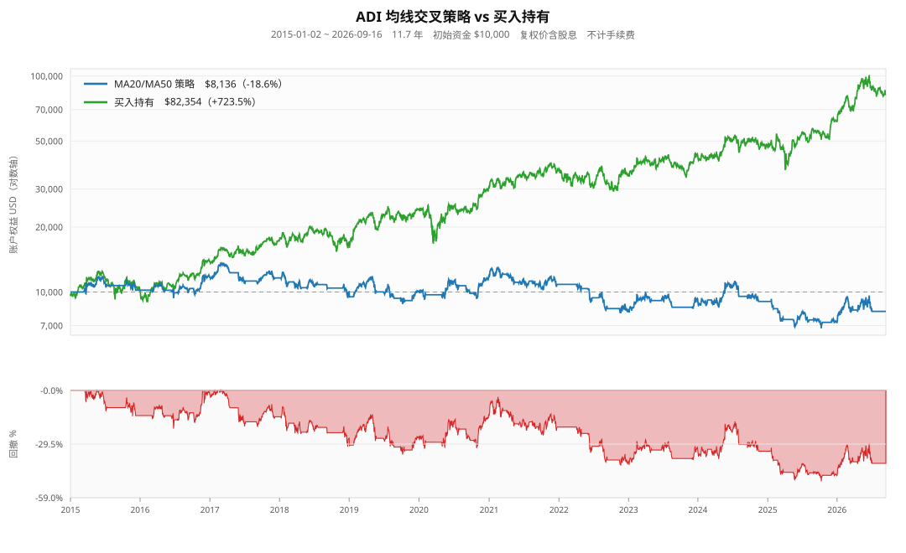

# ADI 均线交叉策略回测报告

- **标的**：ADI（Analog Devices）
- **数据区间**：2015-01-02 ~ 2026-09-16，2943 个交易日（约 11.70 年）
- **数据来源**：yfinance 1.7.0 `auto_adjust=True`（前复权，已计入股息）
- **初始资金**：$10,000.00　**手续费/滑点**：不计
- **成交假设**：信号当日收盘产生，**下一交易日开盘价**成交；全仓进出

## 一、结论先行

**在 ADI 上，MA20/MA50 金叉死叉策略大幅亏损，且被买入持有碾压。**

- 策略期末权益 **$8,135.95**，总收益 **-18.64%**，年化 **-1.75%**
- 同期买入持有 **$82,354.23**，总收益 **+723.54%**，年化 **+19.74%**
- 策略最大回撤 **-50.03%**，反而**比买入持有的 -33.62% 更深**
- 39 笔配对交易，胜率仅 **38.5%**，盈亏比 **0.93**

> **核心判断**：这个策略在 ADI 上不只是「跑输」，而是「负收益 + 更大回撤」——
> 两头都输。它属于典型的 **whipsaw（反复被打脸）** 形态：ADI 长期上行斜率稳定，
> 均线交叉系统在震荡中不断高买低卖，把趋势收益全部磨损掉。

## 二、核心指标对比

| 指标 | MA20/MA50 策略 | 买入持有 | 对比 |
|---|---:|---:|:--:|
| 期末权益 (USD) | 8,135.95 | 82,354.23 | 策略负 |
| 总收益 (%) | -18.64 | +723.54 | 策略负 |
| 年化收益 CAGR (%) | -1.75 | +19.74 | 策略负 |
| 最大回撤 (%) | -50.03 | -33.62 | 策略负 |
| 回撤谷底日期 | 2025-10-10 | 2020-03-18 | — |
| 交易次数（买+卖） | 78 | 1 | — |
| 在场时间占比 | 59.4% | 100% | — |

## 三、逐笔交易统计

| 指标 | 数值 |
|---|---:|
| 完整配对数 | 39 |
| 盈利 / 亏损笔数 | 15 / 24 |
| 胜率 | 38.5% |
| 平均盈利 | +7.83% |
| 平均亏损 | -5.28% |
| 盈亏比（总盈利/总亏损） | 0.93 |
| 平均持仓天数 | 65.0 天（中位数 55 天） |
| 期末是否仍持仓 | 否 |

胜率 38.5% 且盈亏比 0.93 —— **虽然平均盈利（+7.83%）大于平均亏损（-5.28%），但胜率过低（不足 50%），数学期望仍为负**，这是亏损的直接来源。

## 四、逐年收益对比

| 年份 | 策略收益 | 买入持有收益 | 差额 | 策略是否跑赢 |
|---|---:|---:|---:|:--:|
| 2015 | +2.00% | +2.35% | -0.35pp | ❌ |
| 2016 | +14.76% | +34.96% | -20.20pp | ❌ |
| 2017 | -0.72% | +25.30% | -26.02pp | ❌ |
| 2018 | -13.84% | -1.64% | -12.20pp | ❌ |
| 2019 | +0.24% | +41.31% | -41.07pp | ❌ |
| 2020 | +17.75% | +26.87% | -9.12pp | ❌ |
| 2021 | -8.18% | +20.96% | -29.14pp | ❌ |
| 2022 | -23.99% | -4.91% | -19.08pp | ❌ |
| 2023 | +12.19% | +23.36% | -11.16pp | ❌ |
| 2024 | -2.28% | +8.82% | -11.10pp | ❌ |
| 2025 | -20.59% | +29.75% | -50.34pp | ❌ |
| 2026 | +13.29% | +34.69% | -21.40pp | ❌ |

**12 个年份中，策略仅在 0 个年份跑赢买入持有**（0%）。

## 五、多组均线参数横向对比

统一采用「首个可评估日按当时均线状态建仓」口径（与原始脚本一致）。

| 组合 | 期末权益 | 总收益 | CAGR | 最大回撤 | 配对数 | 胜率 | 在场 | 盈亏比 |
|---|---:|---:|---:|---:|---:|---:|---:|---:|
| MA50/MA200 | $30,270.02 | +202.70% | +9.93% | -39.36% | 6 | 66.7% | 71.1% | 5.52 |
| MA20/MA100 | $12,093.12 | +20.93% | +1.64% | -35.83% | 27 | 44.4% | 67.6% | 1.37 |
| MA5/MA50 | $10,947.53 | +9.48% | +0.78% | -54.81% | 57 | 33.3% | 59.4% | 1.18 |
| MA10/MA50 | $9,613.66 | -3.86% | -0.34% | -51.29% | 44 | 36.4% | 59.6% | 1.09 |
| MA20/MA50 | $8,135.95 | -18.64% | -1.75% | -50.03% | 39 | 38.5% | 59.4% | 0.93 |

买入持有基准：总收益 **+723.54%**、CAGR **+19.74%**、最大回撤 **-33.62%**。

即使是表现最好的 **MA50/MA200**（总收益 +202.70%、CAGR +9.93%）仍**远不及买入持有**（+723.54%）。

缩短快线并不能救这个策略：MA5/MA50 交易次数暴增到 57 笔，结果 +9.48%（虽好于 MA20/MA50，但回撤扩大到 -54.81%，且仍远输基准）；MA10/MA50 更是 -18.64%。

## 六、权益曲线与回撤

> 图表由脚本零依赖生成 SVG（`adi_ma_equity.svg`），无需 matplotlib；若环境装有 matplotlib 会额外输出 `adi_ma_equity.png`。

## 七、稳健性检验：初始仓位口径的影响

这是本次回测中最值得警惕的一点 —— **口径差异不改结论，但幅度差异不可忽视**。

| 口径 | 期末权益 | 总收益 | 总交易数 | 配对数 |
|---|---:|---:|---:|---:|
| 首个可评估日按均线状态建仓（= 原脚本） | $8,135.95 | -18.64% | 78 | 39 |
| 仅响应真实交叉（空仓起步） | $7,590.91 | -24.09% | 76 | 38 |

两种口径总收益相差 **5.45 个百分点**。差异来自 MA50 尚未成形阶段：原脚本 `(df['MA20'] > df['MA50']).astype(int)` 把 NaN 比较结果当作 0，于是在 MA50 首个有效日（2015-03-16）凭空产生一个 +1 金叉信号，并在次日以 46.55 建仓。

⚠️ 两种口径都不改变「策略大幅亏损」的结论，但**说明单次回测结果对实现细节敏感**——任何只报一个数字、不交代口径的均线回测都应被质疑。

## 八、为什么这个策略在 ADI 上失效

1. **ADI 是慢牛而非急涨股**：2015 年以来年化约 19.7%，但几乎没有单边快涨行情，均线频繁缠绕。
2. **交叉信号噪声极大**：39 笔配对交易里 24 笔亏损（占 62%），胜率不足一半——盈利笔数太少，无法覆盖频繁交易的磨损。
3. **在场时间只有 59.4%**：错过 40.6% 的上涨时间，而 ADI 的收益高度依赖长期复利累积。
4. **回撤不减反增**：-50.03% 比买入持有的 -33.62% 更深，「择时降低风险」这个卖点在数据上完全不成立。

## 九、对 TradingAgents 项目的建议

| 结论 | 说明 |
|---|---|
| ❌ 不要把 MA20/MA50 交叉作为独立交易信号 | 在 ADI 上期望值为负，且跑输基准 |
| ❌ 不要指望「缩短均线周期」能救 | MA5/MA50 收益转正但仍远输基准，回撤扩大到 -54.81%；MA10/MA50 仍为负 |
| ⚠️ 若要用趋势过滤，长周期（MA50/MA200）相对稳健 | 总收益 +202.70%、胜率 66.7%、盈亏比 5.52，但期末权益仅为买入持有的 1/2.7 |
| ✅ 可以作为**特征**而非**决策** | 把「MA20 是否在 MA50 上方」送进 LLM 分析层做辅助判断，不直接下单 |
| ✅ 回测框架必须做**口径敏感性测试** | 本次 5.45pp 的口径差异说明这一层必不可少 |

**下一步建议测试的改进方向**（当前结论不足以否定所有技术择时）：
- 加入**趋势过滤 + 波动率过滤**（如仅当 ADX 高、ATR 波动适中时才响应交叉）
- 加入**止损/止盈**（当前策略在死叉时才离场，回撤容忍过大）
- 换成**横截面动量选股**而非单标的择时（TradingAgents 多标的场景更契合）
- 与买入持有做**同一风险预算**下的对比，而非同资金对比

---
*报告由 `backtest_adi_analysis.py` 自动生成　|　数据源 yfinance 1.7.0 `auto_adjust=True`　|　区间 2015-01-02 ~ 2026-09-16*