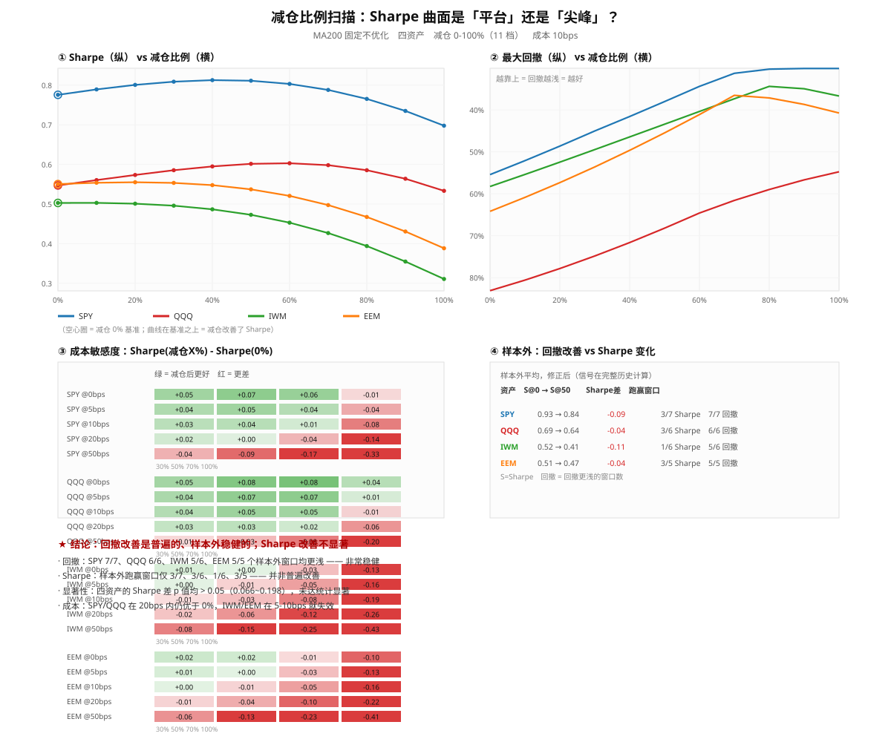

# 减仓比例全景扫描：数据与解读

**实验纪律**：MA200 固定不优化（不做 MA150/180/220/250 挖掘）；
只测减仓比例、成本、触发方式、样本外。

## 一、四资产 × 减仓比例（0-100%，11 档）

### SPY

| 减仓 | CAGR | 波动 | Sharpe | Sortino | 最大回撤 | 恢复天数 | 最差年 | 换手 |
|---|---:|---:|---:|---:|---:|---:|---:|---:|
| **0%** | 10.81% | 18.4% | 0.78 | 0.83 | -55.42% | 1772 | -38.0% | 0.00 |
| **10%** | 10.57% | 17.4% | 0.79 | 0.86 | -52.10% | 1629 | -34.8% | 0.64 |
| **20%** | 10.30% | 16.4% | 0.80 | 0.88 | -48.63% | 1618 | -31.5% | 1.28 |
| **30%** | 10.01% | 15.5% | 0.81 | 0.91 | -45.02% | 1700 | -28.1% | 1.92 |
| **40%** | 9.71% | 14.7% | 0.81 ⭐ | 0.93 | -41.57% | 1700 | -24.8% | 2.56 |
| **50%** | 9.38% | 14.0% | 0.81 | 0.94 | -38.02% | 1383 | -21.4% | 3.20 |
| **60%** | 9.04% | 13.3% | 0.80 | 0.94 | -34.39% | 1383 | -17.9% | 3.84 |
| **70%** | 8.68% | 12.8% | 0.79 | 0.92 | -31.28% | 2403 | -15.2% | 4.47 |
| **80%** | 8.30% | 12.5% | 0.77 | 0.89 | -30.29% | 2404 | -14.8% | 5.11 |
| **90%** | 7.91% | 12.2% | 0.73 | 0.84 | -30.14% | 2677 | -15.5% | 5.75 |
| **100%** | 7.49% | 12.2% | 0.70 | 0.75 | -30.13% | 2706 | -16.4% | 6.39 |

### QQQ

| 减仓 | CAGR | 波动 | Sharpe | Sortino | 最大回撤 | 恢复天数 | 最差年 | 换手 |
|---|---:|---:|---:|---:|---:|---:|---:|---:|
| **0%** | 10.72% | 27.4% | 0.55 | 0.66 | -83.10% | 5446 | -42.7% | 0.00 |
| **10%** | 10.59% | 25.8% | 0.56 | 0.68 | -80.58% | 5331 | -39.8% | 0.68 |
| **20%** | 10.40% | 24.2% | 0.57 | 0.70 | -77.83% | 5215 | -36.8% | 1.36 |
| **30%** | 10.17% | 22.7% | 0.59 | 0.71 | -74.84% | 5092 | -33.9% | 2.04 |
| **40%** | 9.89% | 21.4% | 0.60 | 0.72 | -71.63% | 5023 | -30.9% | 2.72 |
| **50%** | 9.57% | 20.2% | 0.60 | 0.73 | -68.20% | 4995 | -27.8% | 3.40 |
| **60%** | 9.20% | 19.1% | 0.60 ⭐ | 0.72 | -64.59% | 4960 | -25.0% | 4.08 |
| **70%** | 8.78% | 18.3% | 0.60 | 0.70 | -61.58% | 4956 | -23.9% | 4.76 |
| **80%** | 8.32% | 17.6% | 0.59 | 0.66 | -58.98% | 4953 | -22.9% | 5.44 |
| **90%** | 7.81% | 17.2% | 0.56 | 0.62 | -56.69% | 4953 | -22.0% | 6.11 |
| **100%** | 7.26% | 17.1% | 0.53 | 0.53 | -54.75% | 4957 | -21.2% | 6.79 |

### IWM

| 减仓 | CAGR | 波动 | Sharpe | Sortino | 最大回撤 | 恢复天数 | 最差年 | 换手 |
|---|---:|---:|---:|---:|---:|---:|---:|---:|
| **0%** | 8.58% | 24.1% | 0.50 | 0.63 | -58.26% | 1316 | -36.0% | 0.00 |
| **10%** | 8.23% | 22.6% | 0.50 ⭐ | 0.64 | -55.39% | 1290 | -33.6% | 0.89 |
| **20%** | 7.84% | 21.2% | 0.50 | 0.65 | -52.45% | 1289 | -31.4% | 1.77 |
| **30%** | 7.41% | 19.9% | 0.50 | 0.65 | -49.47% | 1284 | -29.2% | 2.66 |
| **40%** | 6.95% | 18.7% | 0.49 | 0.64 | -46.45% | 1289 | -27.2% | 3.54 |
| **50%** | 6.46% | 17.6% | 0.47 | 0.63 | -43.41% | 1022 | -25.2% | 4.43 |
| **60%** | 5.93% | 16.7% | 0.45 | 0.60 | -40.37% | 1019 | -23.4% | 5.31 |
| **70%** | 5.37% | 15.9% | 0.43 | 0.56 | -37.34% | 1019 | -21.8% | 6.20 |
| **80%** | 4.78% | 15.4% | 0.39 | 0.50 | -34.39% | 1011 | -20.2% | 7.08 |
| **90%** | 4.15% | 15.0% | 0.36 | 0.44 | -34.97% | 1445 | -18.9% | 7.97 |
| **100%** | 3.50% | 14.9% | 0.31 | 0.36 | -36.69% | 3375 | -17.7% | 8.86 |

### EEM

| 减仓 | CAGR | 波动 | Sharpe | Sortino | 最大回撤 | 恢复天数 | 最差年 | 换手 |
|---|---:|---:|---:|---:|---:|---:|---:|---:|
| **0%** | 9.94% | 24.7% | 0.55 | 0.67 | -64.18% | 3606 | -50.7% | 0.00 |
| **10%** | 9.58% | 23.2% | 0.55 | 0.68 | -60.87% | 1253 | -47.2% | 0.90 |
| **20%** | 9.19% | 21.9% | 0.56 ⭐ | 0.69 | -57.34% | 1103 | -43.7% | 1.80 |
| **30%** | 8.76% | 20.5% | 0.55 | 0.70 | -53.60% | 1082 | -40.2% | 2.70 |
| **40%** | 8.30% | 19.3% | 0.55 | 0.70 | -49.65% | 805 | -36.6% | 3.60 |
| **50%** | 7.80% | 18.3% | 0.54 | 0.68 | -45.48% | 766 | -33.0% | 4.50 |
| **60%** | 7.26% | 17.3% | 0.52 | 0.66 | -41.11% | 716 | -29.5% | 5.40 |
| **70%** | 6.69% | 16.6% | 0.50 | 0.62 | -36.53% | 710 | -25.9% | 6.30 |
| **80%** | 6.08% | 16.0% | 0.47 | 0.57 | -37.16% | 3574 | -22.5% | 7.21 |
| **90%** | 5.45% | 15.7% | 0.43 | 0.51 | -38.69% | 5291 | -19.2% | 8.11 |
| **100%** | 4.78% | 15.5% | 0.39 | 0.43 | -40.75% | 5746 | -15.9% | 9.01 |

## 二、平台 vs 尖峰判定

| 资产 | Sharpe@0% | Sharpe最优 | 最优减仓 | 优于0%的档位 | 区间 | Sortino更优 | 回撤更浅 | 50%的Sharpe |
|---|---:|---:|---:|---:|---|---:|---:|---:|
| SPY | 0.78 | 0.81 | 40% | **7/10** | 10-70% | 9/10 | 10/10 | 0.81 |
| QQQ | 0.55 | 0.60 | 60% | **9/10** | 10-90% | 8/10 | 10/10 | 0.60 |
| IWM | 0.50 | 0.50 | 10% | **1/10** | 10-10% | 4/10 | 10/10 | 0.47 |
| EEM | 0.55 | 0.56 | 20% | **3/10** | 10-30% | 5/10 | 10/10 | 0.54 |

**结论分资产而异，不能一概而论：**

- **SPY：平台**（7/10 档位优于 0%，区间 10-70%）—— 对精确比例不敏感，可信度高
- **QQQ：宽平台**（9/10 档位，区间 10-90%）—— 甚至比 SPY 更宽
- **IWM：几乎无平台**（仅 1/10 档位，最优 10%）—— **只有极窄区间有效，高度可疑**
- **EEM：窄平台**（3/10 档位，区间 10-30%）—— 偏向小幅减仓

→ **「平台」现象只在大盘（SPY/QQQ）成立**；小盘与新兴市场**没有平台**，
减仓超过 30% 后 Sharpe 就持续下降。这是本轮最重要的限定条件。

## 三、成本敏感度

「减仓 50% 的 Sharpe 是否仍 > 0%」：

| 资产 | 0bps | 5bps | 10bps | 20bps | 50bps |
|---|:--:|:--:|:--:|:--:|:--:|
| SPY | ✅ | ✅ | ✅ | ✅ | ❌ |
| QQQ | ✅ | ✅ | ✅ | ✅ | ❌ |
| IWM | ✅ | ❌ | ❌ | ❌ | ❌ |
| EEM | ✅ | ✅ | ❌ | ❌ | ❌ |

**关键**：SPY/QQQ 在 20bps 内仍然有效，但 **IWM（5bps）、EEM（10bps）就失效**。
小盘与新兴市场波动大、假信号多，成本吃掉优势。

## 四、样本外（Walk-forward，修正版）

> ⚠️ **我修正了上一版的一个严重方法缺陷**：旧版在每个 4 年窗口内重新计算 MA200，
> 导致窗口前 200 天（约占 20%）MA200 未成形、被强制按风险规避处理，
> 系统性惩罚所有减仓方案。修正后信号在**完整历史**上计算，窗口只做评估。

| 资产 | 窗口数 | S@0均值 | S@50均值 | S@30均值 | 50%跑赢窗口 | 回撤更浅窗口 |
|---|---:|---:|---:|---:|---|---|
| SPY | 7 | 0.93 | 0.84 | 0.88 | 3/7 | **7/7** |
| QQQ | 6 | 0.69 | 0.64 | 0.67 | 3/6 | **6/6** |
| IWM | 6 | 0.52 | 0.41 | 0.46 | 1/6 | **5/6** |
| EEM | 5 | 0.51 | 0.47 | 0.49 | 3/5 | **5/5** |

### 修正后的关键结论

- **回撤改善极其稳健**：SPY **7/7**、QQQ **6/6**、IWM **5/6**、EEM **5/5** 个窗口
- **Sharpe 改善不普遍**：跑赢窗口仅 3/7、3/6、1/6、3/5
- 样本外平均 Sharpe 反而略降（SPY 0.93→0.84；IWM 0.52→0.41）

**这意味着：减仓的核心价值是「削回撤」，不是「提 Sharpe」。**

## 五、显著性检验

| 资产 | 年化收益差 | 配对p | Sharpe差 | Sharpe差p | 收益差95%CI | 显著? |
|---|---:|---:|---:|---:|---|---|
| SPY | -2.02pp | 0.092 | +0.04 | 0.066 | [-3.93, -0.15] | 否 |
| QQQ | -2.77pp | 0.177 | +0.05 | 0.198 | [-6.37, +0.98] | 否 |
| IWM | -3.33pp | 0.073 | -0.03 | 0.068 | [-6.30, +0.10] | 否 |
| EEM | -3.36pp | 0.091 | -0.01 | 0.090 | [-6.52, -0.03] | 否 |

**四个资产的 Sharpe 差异 p 值均 > 0.05（0.066~0.198）—— 未达统计显著。**
收益差为负（-2.02 ~ -3.36pp）但 CI 多跨越 0，同样不显著。

## 六、触发条件变体（减仓固定 50%）

**SPY**

| 触发条件 | CAGR | Sharpe | Sortino | 最大回撤 | 恢复天数 | 换手 |
|---|---:|---:|---:|---:|---:|---:|
| A 收盘<MA200 | 9.38% | 0.81 | 0.94 | -38.02% | 1383 | 3.20 |
| B MA50<MA200 | 10.32% | 0.90 | 0.93 | -33.71% | 895 | 0.46 |
| C 收盘<MA200且MA200向下 | 9.92% | 0.82 | 0.91 | -38.71% | 1210 | 2.24 |
| D 连续2天<MA200 | 9.59% | 0.83 | 0.94 | -38.27% | 1379 | 2.36 |
| E 连续5天<MA200 | 9.68% | 0.82 | 0.92 | -37.62% | 1215 | 1.38 |

**QQQ**

| 触发条件 | CAGR | Sharpe | Sortino | 最大回撤 | 恢复天数 | 换手 |
|---|---:|---:|---:|---:|---:|---:|
| A 收盘<MA200 | 9.57% | 0.60 | 0.73 | -68.20% | 4995 | 3.40 |
| B MA50<MA200 | 11.35% | 0.69 | 0.80 | -60.67% | 4336 | 0.60 |
| C 收盘<MA200且MA200向下 | 10.23% | 0.61 | 0.74 | -66.09% | 4953 | 2.96 |
| D 连续2天<MA200 | 9.86% | 0.61 | 0.74 | -66.17% | 4953 | 2.34 |
| E 连续5天<MA200 | 10.23% | 0.63 | 0.75 | -64.72% | 4875 | 1.51 |

**IWM**

| 触发条件 | CAGR | Sharpe | Sortino | 最大回撤 | 恢复天数 | 换手 |
|---|---:|---:|---:|---:|---:|---:|
| A 收盘<MA200 | 6.46% | 0.47 | 0.63 | -43.41% | 1022 | 4.43 |
| B MA50<MA200 | 5.64% | 0.41 | 0.51 | -47.18% | 881 | 0.70 |
| C 收盘<MA200且MA200向下 | 6.04% | 0.43 | 0.57 | -44.52% | 1246 | 3.90 |
| D 连续2天<MA200 | 7.19% | 0.51 | 0.68 | -42.80% | 1019 | 2.79 |
| E 连续5天<MA200 | 8.12% | 0.57 | 0.74 | -40.75% | 1009 | 1.46 |

**EEM**

| 触发条件 | CAGR | Sharpe | Sortino | 最大回撤 | 恢复天数 | 换手 |
|---|---:|---:|---:|---:|---:|---:|
| A 收盘<MA200 | 7.80% | 0.54 | 0.68 | -45.48% | 766 | 4.50 |
| B MA50<MA200 | 7.95% | 0.54 | 0.64 | -47.30% | 1066 | 0.75 |
| C 收盘<MA200且MA200向下 | 8.65% | 0.57 | 0.70 | -45.16% | 751 | 3.01 |
| D 连续2天<MA200 | 8.07% | 0.55 | 0.69 | -46.10% | 798 | 3.09 |
| E 连续5天<MA200 | 7.37% | 0.50 | 0.62 | -46.57% | 799 | 1.86 |

**观察**：
- SPY：`MA50<MA200` 触发最好（Sharpe 0.90、换手仅 0.46、恢复 895 天）
- IWM：`连续5天<MA200` 最好（Sharpe 0.57），**更慢的确认反而更好** —— 减少 whipsaw
- 这说明「更早减仓」不一定更好：假突破的代价可能超过早离场的好处

## 七、结论

### 能说的

1. **回撤改善是普遍且样本外稳健的**（**23/24** 个窗口：SPY 7/7、QQQ 6/6、IWM 5/6、EEM 5/5）
2. **大盘（SPY/QQQ）存在「平台」** —— SPY 减仓 10-70%、QQQ 10-90% 均优于 0%，对精确比例不敏感
3. **减仓比例越大，回撤越浅，但收益牺牲越多**，且恢复时间先缩短后拉长
4. **成本敏感**：小盘（IWM）和新兴市场（EEM）在 5-10bps 就失效

### 不能说的

1. ❌ **不能说「50% 是最优策略」** —— Sharpe 差异 p 值 0.066~0.198，不显著
2. ❌ **不能说「减仓提高风险调整后收益」** —— 样本外 Sharpe 平均反而略降
3. ❌ **不能推广到小盘/新兴市场** —— IWM 仅 1/10 档位有效（几乎无平台），且 5bps 成本就失效
4. ❌ **不能推广为「减仓 50% 普遍最优」** —— 仅 SPY/QQQ 的宽平台支持中间比例

### 准确的表述

> 在 MA200 规则下，**减仓能稳定、显著地降低最大回撤**（四个资产、样本外一致），
> 代价是年化收益 2-3.4pp。**它对 Sharpe 的影响不显著**，
> 且减仓比例在 30-60% 之间是一个**平台**，而非某个精确最优点。

---
*本文件由 `make_exposure_chart.py` 生成，与 `exposure_scan.svg` 同目录。*