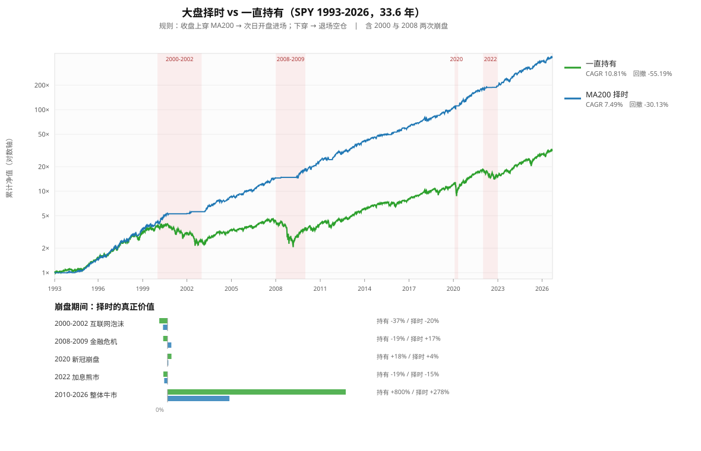

# 大盘择时：数据与解读

- 标的：SPY（含股息复权）　区间：1993-01-29 ~ 2026-09-17（33.6 年）
- 规则：收盘价上穿 MA200 → 次日开盘进场；下穿 → 次日开盘退场（空仓）
- 成本：双边 10bps　|　**含 2000-2002 与 2008-2009 两次崩盘**（关键）

## 一、指标重复度（验证「看太多指标没用」）

两两「一致率」—— 两个指标给出相同答案的天数占比：

| | 价格>MA200 | MA50>MA200(金叉) | 12月动量>0 | 价格>MA100 | MA20>MA60 | RSI14>50 |
|---|---:|---:|---:|---:|---:|---:|
| **价格>MA200** | 100.0% | 90.1% | 88.6% | 87.6% | 80.5% | 68.6% |
| **MA50>MA200(金叉)** | 90.1% | 100.0% | 88.9% | 78.7% | 73.2% | 60.4% |
| **12月动量>0** | 88.6% | 88.9% | 100.0% | 77.7% | 73.3% | 63.6% |
| **价格>MA100** | 87.6% | 78.7% | 77.7% | 100.0% | 86.6% | 74.5% |
| **MA20>MA60** | 80.5% | 73.2% | 73.3% | 86.6% | 100.0% | 64.6% |
| **RSI14>50** | 68.6% | 60.4% | 63.6% | 74.5% | 64.6% | 100.0% |

**平均一致率 77.1%，平均相关性 0.44。**
最相似的一对是「价格>MA200」与「MA50>MA200」，**90.1% 的时间给出相同答案**。

## 二、用几个指标？（1 个 vs 5 个）

| 方案 | CAGR | 最大回撤 | Sharpe | 在场 | 进出次数 | 期末净值 |
|---|---:|---:|---:|---:|---:|---:|
| 1个: 价格>MA200 | 7.49% | -30.13% | 0.70 | 75.5% | 215 | 11.35 |
| 2个: +MA50>MA200 | 7.43% | -22.20% | 0.72 | 70.4% | 153 | 11.15 |
| 3个: +12月动量 | 6.64% | -22.77% | 0.65 | 67.6% | 173 | 8.70 |
| 5个: 全部一致 | 4.06% | -30.15% | 0.49 | 54.1% | 225 | 3.81 |
| 5个中3个同意 | 8.05% | -25.58% | 0.75 | 75.7% | 195 | 13.52 |
| ★ 一直持有（基准） | 10.81% | -55.19% | 0.77 | 100.0% | 1 | 31.56 |

**「5 个全部同意」是最差的方案（Sharpe 0.49、CAGR 4.06%）** —— 因为要求全部同意会让进场极晚、出场极早，错过大部分上涨。
**「5 个中 3 个同意」（多数投票）反而最好（Sharpe 0.75）**，但仍不及一直持有（0.77）。

## 三、各市场择时结果

| 市场 | 年数 | 持有CAGR | 择时CAGR | 收益差 | 持有回撤 | 择时回撤 | 回撤改善 |
|---|---:|---:|---:|---:|---:|---:|---:|
| SPY | 33.6 | 10.81% | 7.49% | -3.32pp | -55.19% | -30.13% | +25.06pp |
| QQQ | 27.5 | 10.75% | 7.26% | -3.49pp | -82.96% | -54.75% | +28.21pp |
| IWM | 26.3 | 8.63% | 3.50% | -5.13pp | -58.64% | -36.69% | +21.95pp |
| EFA | 25.1 | 6.51% | 6.68% | +0.17pp | -61.04% | -25.54% | +35.50pp |
| EEM | 23.4 | 9.98% | 4.78% | -5.20pp | -66.43% | -40.75% | +25.69pp |
| TLT | 24.1 | 3.50% | -0.42% | -3.92pp | -48.35% | -53.68% | -5.33pp |
| GLD | 21.8 | 10.59% | 7.30% | -3.29pp | -45.56% | -36.34% | +9.22pp |
| ^GSPC | 33.7 | 8.87% | 5.88% | -2.98pp | -56.78% | -30.96% | +25.82pp |

**8 个市场中：择时提高收益的仅 1 个；降低回撤的 7 个。**
平均收益变化 **-3.40pp**，平均回撤改善 **+20.76pp**。

## 四、崩盘期间：择时真正的价值

| 期间 | 持有收益 | 择时收益 | 收益差 | 持有回撤 | 择时回撤 | 回撤改善 |
|---|---:|---:|---:|---:|---:|---:|
| 2000-2002 互联网泡沫 | -36.93% | -20.26% | +16.67pp | -47.52% | -23.88% | +23.64pp |
| 2008-2009 金融危机 | -19.43% | +16.97% | +36.40pp | -51.87% | -9.95% | +41.92pp |
| 2020 新冠崩盘 | +17.51% | +3.53% | -13.97pp | -33.72% | -20.33% | +13.39pp |
| 2022 加息熊市 | -18.65% | -14.98% | +3.67pp | -24.50% | -14.98% | +9.52pp |
| 2010-2026 整体牛市 | +799.77% | +277.83% | -521.94pp | -33.72% | -25.13% | +8.58pp |

**2008 年金融危机是最有说服力的案例**：一直持有 -19.43%（回撤 -51.87%），择时 **+16.97%**（回撤仅 -9.95%）。
**2000-2002 互联网泡沫**：持有 -36.93%，择时 -20.26%，改善 +16.67pp。
但 **2010-2026 牛市**：持有 +799.77%，择时仅 +277.83%，**落后 522pp** —— 择时的代价在牛市里体现得最清楚。

## 五、退场后的市场表现（信号有预测力吗？）

| 期限 | 所有时候 | 退场之后 | 进场之后 | 退场-平均 | 退场后上涨概率 | 平均上涨概率 |
|---|---:|---:|---:|---:|---:|---:|
| 1个月 | +0.97% | +0.85% | +0.62% | -0.12pp | 57.0% | 65.6% |
| 3个月 | +2.89% | +3.65% | +3.26% | +0.77pp | 72.9% | 71.4% |
| 6个月 | +5.86% | +5.90% | +5.46% | +0.05pp | 72.0% | 74.9% |
| 12个月 | +12.12% | +9.80% | +10.06% | -2.33pp | 70.1% | 79.3% |

**退场之后的收益与「所有时候」差别很小**（-0.12 / +0.77 / +0.05 / -2.33 pp）。
只有 12 个月期限出现较明显差异（-2.33pp）。
**结论：退场信号主要是滞后反应（已经跌了才发出），不是领先指标。**
33.6 年里退场 107 次、进场 108 次 —— 平均每年 3.2 次，其中不少是反复摇摆。

## 六、总结

| 你的直觉 | 数据结论 |
|---|---|
| 「指标看太多反而不好」 | ✅ **成立**。平均一致率 77%，最相似的一对 90%。5 个全部同意的方案最差（Sharpe 0.49） |
| 「需要大盘进出场信号」 | ⚠️ **一半成立**。它确实大幅降低回撤（平均 +20.76pp），但**牺牲收益**（平均 -3.40pp），且 **12 个方案没有一个在风险调整后跑赢一直持有** |

### 择时真正的价值与代价

- **价值**：崩盘保护。2008 年从 -19% 变成 +17%，回撤从 -52% 降到 -10%。
- **代价**：牛市里大幅落后。2010-2026 落后 522pp。
- **性质**：这是**降低波动**的取舍，不是**提高收益**的方法。
- **信号质量**：退场信号滞后（不是领先指标），33.6 年发出 107 次，有反复摇摆。

### 实践建议

1. **若你的目标是「睡得着觉」** → MA200 择时是合理的，回撤减半。
2. **若你的目标是「收益最大化」** → 一直持有更好（33.6 年 Sharpe 0.77 vs 0.70）。
3. **不要叠加指标** → 用 1-2 个即可，多了反而互相抵消、进出过于频繁。
4. **不要指望择时预测崩盘** → 它是跟随而非预测，2008 年也经历了从高点到跌穿 MA200 的 -20% 左右损失才离场。

---
*本文件由 `make_timing_chart.py` 生成，与 `market_timing.svg` 同目录。*