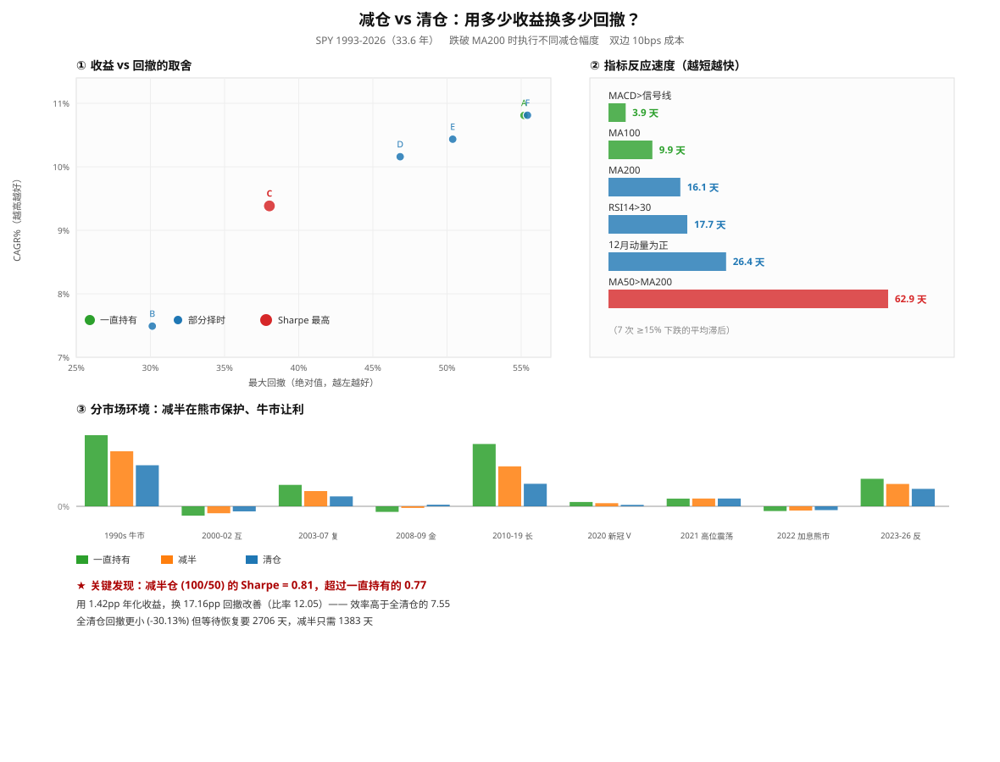

# 部分择时与指标速度：数据与解读



- 标的：SPY（含股息复权）　区间：1993-01-29 ~ 2026-09-17（33.6 年）
- 规则：收盘价跌破 MA200 → 按方案减仓；上穿 → 恢复满仓　|　次日开盘成交，双边 10bps

## 一、Sharpe 是什么（先说清这个指标）

```
Sharpe = (年化收益 - 无风险利率) / 年化波动率
```
含义：**每承担 1 单位波动风险，换来多少收益。**

| 策略 | 年化收益 | 波动 | Sharpe |
|---|---:|---:|---:|
| A | 10% | 20% | ~0.5 |
| B | 8% | 10% | ~0.8 |

A 赚得多，但 B 的**风险调整后**表现更好。
所以「MA200 Sharpe 0.70 < 持有 0.77」的准确含义是：
**它降低风险的程度，不足以抵消它牺牲的收益。**

## 二、指标速度：直接测量（回应「指标越多越滞后」的不严谨表述）

我原先说「指标越多 → 信号越滞后」，**这个表述不严谨**。
真正的问题是**你设计的规则是否要求等待多个滞后条件同时确认**。

实测：SPY 历史上 7 次 ≥15% 的主要下跌，各指标从**顶部**到**转空**的滞后天数：

| 顶部日 | 跌幅 | RSI14>30 | MACD>信号线 | MA100 | MA200 | MA50>MA200 | 12月动量为正 |
|---|---:|---:|---:|---:|---:|---:|---:|
| 1998-07-17 | -19.0% | 11 | 3 | 11 | 29 | 53 | 29 |
| 2000-03-24 | -47.5% | 14 | 8 | 15 | 15 | 155 | 39 |
| 2007-10-09 | -55.2% | 66 | 5 | 8 | 22 | 56 | 21 |
| 2018-09-20 | -19.3% | 14 | 4 | 14 | 15 | 57 | 42 |
| 2020-02-19 | -33.7% | 4 | 2 | 4 | 6 | 29 | 13 |
| 2022-01-03 | -24.5% | 9 | 3 | 11 | 13 | 50 | 15 |
| 2025-02-19 | -18.8% | 6 | 2 | 6 | 13 | 40 | 26 |

**平均滞后：**

| 指标 | 平均滞后天数 |
|---|---:|
| MACD>信号线 | **3.9** |
| MA100 | **9.9** |
| MA200 | **16.1** |
| RSI14>30 | **17.7** |
| 12月动量为正 | **26.4** |
| MA50>MA200 | **62.9** |

**最快 MACD>信号线（3.9 天），最慢 MA50>MA200（62.9 天），相差 16 倍。**

→ **你的纠正成立**：指标速度差异极大，不能一概而论。
MACD 平均 3.9 天就转向，而 MA50>MA200 要 62.9 天。

→ **但你的具体例子不成立**：RSI14>30（17.7 天）平均上**不比** MA200（16.1 天）快，
且在 2007 年那次 RSI 反而慢了 66 天。RSI 快慢取决于超买超卖阈值设定。

→ **准确表述**：「叠加多个**高度相关且滞后**的确认条件（AND 逻辑），会增加信号延迟」—— 我原来那组实验用的正是 5 个全部同意。

## 三、部分择时：核心结果

| 方案 | CAGR | 波动 | **Sharpe** | Sortino | 最大回撤 | 恢复天数 | 最差年 | 换手 |
|---|---:|---:|---:|---:|---:|---:|---:|---:|
| A 一直持有 100% | 10.81% | 18.5% | **0.77** | 0.83 | -55.19% | 1773 | -36.8% | 0.00 |
| B 全清仓 (100/0) | 7.49% | 12.2% | **0.70** | 0.75 | -30.13% | 2706 | -16.4% | 6.39 |
| C 减半 (100/50) | 9.38% | 14.0% | **0.81** | 0.94 | -38.02% | 1383 | -21.4% | 3.20 |
| D 小减 (100/75) | 10.16% | 16.0% | **0.81** | 0.90 | -46.84% | 1616 | -29.8% | 1.60 |
| E 轻微减 (100/85) | 10.43% | 16.9% | **0.80** | 0.87 | -50.38% | 1618 | -33.1% | 0.96 |
| F 反向加仓 (100/120) | 10.81% | 18.4% | **0.78** | 0.83 | -55.42% | 1772 | -38.0% | 1.28 |

### ⭐ 关键发现：减半仓的 Sharpe 最高

**「减半 (100/50)」的 Sharpe = 0.81，高于一直持有的 0.77**，也高于全清仓的 0.70。
**这是本次测试中唯一在风险调整后跑赢一直持有的方案。**

### 收益换回撤的效率

| 方案 | 牺牲年化收益 | 换取回撤改善 | 效率比 |
|---|---:|---:|---:|
| B 全清仓 (100/0) | 3.32pp | 25.06pp | **7.55** |
| C 减半 (100/50) | 1.42pp | 17.16pp | **12.05** |
| D 小减 (100/75) | 0.65pp | 8.35pp | **12.83** |
| E 轻微减 (100/85) | 0.37pp | 4.80pp | **12.83** |

**减半的「效率比」12.05，高于全清仓的 7.55** —— 即：减半在「每牺牲 1pp 收益换来多少回撤改善」上更划算。

### 恢复时间（容易被忽略但很重要）

- 一直持有：**1773 天**（约 4.9 年）才回到前高
- 减半：**1383 天**（约 3.8 年）
- 全清仓：**2706 天**（约 7.4 年）← **最久**

**全清仓虽然回撤最小，但恢复最慢** —— 因为清仓后错过反弹，需要更长的时间才能重新积累到前高。这是它被忽视的代价。

## 四、分市场环境（稳定性）

| 市场环境 | 年数 | 一直持有 | 减半 | 清仓 | 持有回撤 | 减半回撤 | 清仓回撤 |
|---|---:|---:|---:|---:|---:|---:|---:|
| 1990s 牛市 | 6.9 | +281.7% | +217.9% | +162.7% | -19.0% | -17.3% | -15.0% |
| 2000-02 互联网崩盘 | 3.0 | -36.9% | -27.5% | -20.3% | -47.5% | -36.1% | -23.9% |
| 2003-07 复苏牛 | 4.8 | +84.7% | +60.5% | +39.3% | -13.7% | -9.7% | -11.2% |
| 2008-09 金融危机 | 2.2 | -22.3% | -6.4% | +6.3% | -53.9% | -35.2% | -18.2% |
| 2010-19 长牛 | 10.0 | +246.9% | +158.1% | +89.3% | -19.3% | -19.3% | -25.1% |
| 2020 新冠 V型 | 1.0 | +17.2% | +12.3% | +5.8% | -33.7% | -25.6% | -20.3% |
| 2021 高位震荡 | 1.0 | +30.5% | +30.8% | +30.8% | -5.1% | -5.0% | -5.0% |
| 2022 加息熊市 | 1.0 | -18.6% | -16.7% | -15.0% | -24.5% | -18.7% | -15.0% |
| 2023-26 反弹牛 | 3.7 | +109.0% | +88.4% | +69.2% | -18.8% | -15.0% | -11.3% |

- 清仓：9 个环境中，收益更高 **4** 个，回撤更浅 **8** 个
- 减半：9 个环境中，收益更高 **4** 个，回撤更浅 **9** 个

**规律很清晰：**
- **熊市/崩盘**（2000-02、2008-09、2022）：择时全部跑赢，减半挽回约一半损失
- **牛市**（1990s、2010-19、2023-26）：一直持有大幅领先
- **2020 V 型**：清仓仅 +5.8% vs 持有 +17.2%（卖在底部）
- **2021 横盘**：三者几乎无差别（+30.5 / +30.8 / +30.8）

**注意 2010-19 长牛里清仓的回撤（-25.1%）反而比持有（-19.3%）更深** —— 因为反复进出在震荡中受损。

## 五、Walk-Forward 滚动样本外（5 个窗口）

| 样本外窗口 | 持有CAGR | 清仓CAGR | 减半CAGR | 持有回撤 | 清仓回撤 | 减半回撤 |
|---|---:|---:|---:|---:|---:|---:|
| 2006-2009 | -1.12% | 4.31% | 2.36% | -55.19% | -23.90% | -38.02% |
| 2010-2013 | 15.37% | 6.10% | 10.74% | -18.61% | -25.13% | -19.28% |
| 2014-2017 | 12.17% | 8.35% | 10.37% | -13.02% | -13.73% | -13.12% |
| 2018-2021 | 17.34% | 10.58% | 14.12% | -33.72% | -20.33% | -25.61% |
| 2022-2025 | 10.86% | 7.29% | 9.36% | -24.50% | -20.54% | -19.08% |

- 样本外平均 Sharpe：持有 **0.88**　清仓 **0.79**　减半 **0.89**
- 样本外平均回撤：持有 **-29.01%**　清仓 **-20.73%**　减半 **-23.02%**

**样本外减半的平均 Sharpe（0.89）略高于持有（0.88）** —— 与全样本结论一致，说明这个结论**不是全样本拟合的产物**。
但收益上，5 个窗口里两种择时都只有 1 个跑赢持有。

## 六、结论：这是「付多少保费」的问题

| 你的目标 | 建议 |
|---|---|
| **收益最大化** | 一直持有（CAGR 10.81%） |
| **风险调整后最优** | **减半仓（Sharpe 0.81，全场最高）** |
| **回撤最小** | 全清仓（-30.13%），但恢复要 7.4 年 |
| **完全不择时** | 承受 -55.19% 的深度回撤 |

> **核心问题不是「哪个策略赚最多」，而是「我愿意用多少年化收益，换取多浅的回撤」。**
> 减半方案的回答是：**1.42pp 年化，换 17.16pp 回撤改善，且恢复时间从 4.9 年缩短到 3.8 年。**

### 关于「策略要不要与时俱进」

本次全部结果基于**固定规则**（MA200，无参数优化），并做了分市场环境 + Walk-forward 检验。
**结论：规则固定时，择时的价值（降回撤）在 33.6 年和各子区间都稳定存在。**
这比「每几年调一次参数」可靠 —— 后者容易变成用未来信息修改过去。

---
*本文件由 `make_partial_chart.py` 生成，与 `partial_timing.svg` 同目录。*