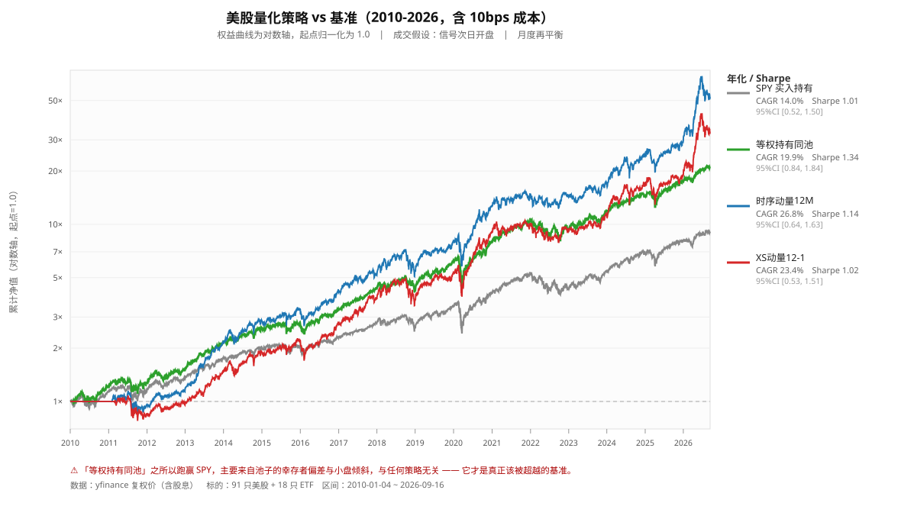

# 权益曲线数据与解读

- 区间：2010-01-04 ~ 2026-09-16（16.70 年）
- 成本：10 bps（双边，按换手计）；成交：信号次日开盘；月度再平衡
- 数据：yfinance `auto_adjust=True`（复权价，含股息）

## 关键数值

| 策略/基准 | 期末净值 | 总收益 | CAGR | Sharpe | 95% CI | 最大回撤 |
|---|---:|---:|---:|---:|---|---:|
| SPY 买入持有 | 8.92× | +791.5% | +14.00% | 1.01 | [0.52, 1.50] | -33.72% |
| 等权持有同池 | 20.80× | +1980.0% | +19.93% | 1.34 | [0.84, 1.84] | -31.94% |
| 时序动量12M | 52.56× | +5155.9% | +26.78% | 1.14 | [0.64, 1.63] | -34.10% |
| XS动量12-1 | 33.37× | +3236.7% | +23.37% | 1.02 | [0.53, 1.51] | -33.95% |

## 解读

1. **等权持有同池（19.93%/年）显著跑赢 SPY（14.00%/年）**，年化差 +5.93pp。
   但这个超额**不来自任何策略** —— 它来自：(a) 股票池的幸存者偏差，(b) 等权相对市值加权的小盘倾斜。
2. **任何以「跑赢 SPY」为卖点的策略都可能是假的。**正确的对照是等权持有同一池（绿色线）。
3. 动量类策略（时序动量、XS动量）CAGR 高于等权池，但在 5% 水平上**未显著**跑赢（p=0.082 / 0.254），且波动与回撤更大、换手更高。
4. Sharpe 的 95% 置信区间都很宽（跨度约 1.0），说明**单看 Sharpe 排名并不足以区分这些策略** —— 这正是 Lo (2002) 指出的 Sharpe 标准误问题。

> ⚠️ 幸存者偏差无法用 yfinance 修正（退市股数据缺失）。详见 `docs/backtest-pitfalls-checklist.md` 与 `delisted_reality_check.csv`。

*本文件由 `make_charts.py` 自动生成，与 `strategy_equity.svg` 同目录，便于版本控制与离线阅读。*